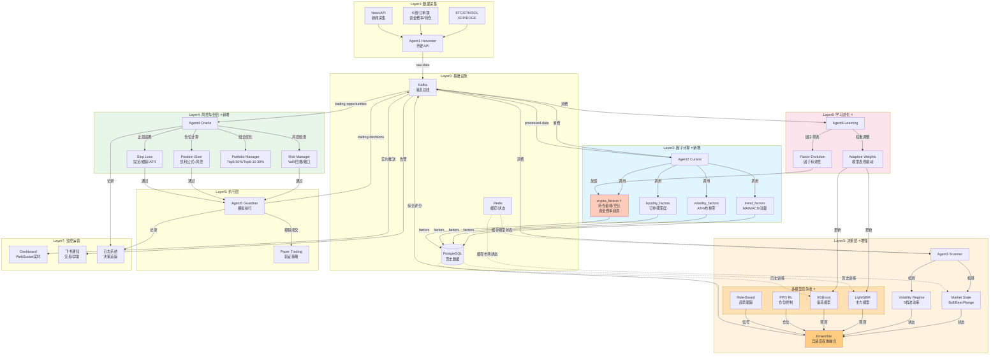

# AM-HK v2.03 系统架构流程图



## 核心数据流

```
币安API → Agent1 → raw-data(Kafka) → Agent2 → processed-data(Kafka) 
                                                              ↓
[因子库: 趋势/波动/流动性/Crypto特有] → PostgreSQL (历史存储)
                                                              ↓
Agent3 ← Market State + Volatility Regime (市场状态检测)
                                                              ↓
[多模型池: LGBM/XGB/RL/规则] → Ensemble (自适应权重融合)
                                                              ↓
trading-opportunities(Kafka) → Agent4 (风控检查)
                                                              ↓
[Risk Manager + Position Sizer + Stop Loss + Portfolio Manager]
                                                              ↓
通过 → Agent5 (模拟执行/Paper Trading)
                                                              ↓
trading-decisions(Kafka) → Agent6 (学习进化/权重调整)
                                                              ↓
反馈 → 模型权重更新 + 因子有效性评估
```

## 关键决策点

| 阶段 | 决策内容 | 模块 |
|------|---------|------|
| 数据采集 | 币种选择、周期配置 | Agent1 |
| 因子计算 | 30+ 技术指标实时计算 | Agent2 Factors |
| 市场状态 | Bull/Bear/Range 判断 | Market State Engine |
| 模型预测 | 4模型并行预测 | Model Pool |
| 权重融合 | 动态权重 = f(市场状态, 历史表现) | Ensemble |
| 风控检查 | VaR、回撤、敞口限制 | Risk Manager |
| 仓位计算 | 凯利公式 + 风险调整 | Position Sizer |
| 止损管理 | 固定/跟踪/ATR/时间 | Stop Loss |
| 组合优化 | Top5 50% + Top6-10 30% | Portfolio Manager |
| 学习进化 | 权重自适应调整 | Agent6 Learning |

## 新增/增强模块 (v2.03)

### 🆕 新增
- `crypto_factors.py` - Crypto特有因子（持仓量、多空比、爆仓风险）
- `rl_model.py` - PPO强化学习仓位控制
- `ensemble.py` - 多模型自适应权重融合
- `market_state.py` - 市场状态检测引擎
- `volatility_regime.py` - 5档波动率状态
- `adaptive_weights.py` - 自适应权重调整
- `position_sizer.py` - 凯利公式仓位管理
- `stop_loss.py` - 多类型止损管理
- `risk_manager.py` - 组合级风控系统

### ⭐ 增强
- Agent2: 30+ 因子（原基础 → 趋势/波动/流动性/Crypto）
- Agent3: 单模型 → 4模型竞争池 + 自适应融合
- Agent4: 新增完整风控链路
- Agent6: 新增学习进化能力

## 技术栈

```
数据采集: 币安 REST API
消息队列: Kafka (14 topics)
缓存系统: Redis
数据存储: PostgreSQL + TimescaleDB
机器学习: LightGBM, XGBoost, RLlib (PPO)
实时推理: 本地模型，<10ms延迟
风控引擎: 自定义实现 (VaR, CVaR)
监控系统: 飞书通知 + WebSocket Dashboard
```
